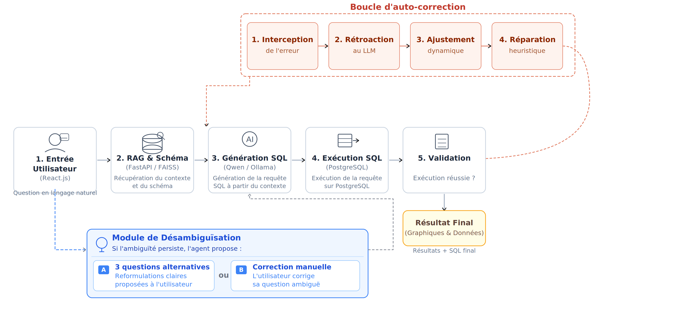

# Txt2SQL Expert ERP P

Ce projet est un moteur de recherche en langage naturel (Natural Language to SQL) conçu pour un ERP du secteur cosmétique. Il permet de poser des questions complexes en français et de recevoir les résultats directement depuis une base PostgreSQL.

---

##  Fonctionnalités Clés

- **Interface Conversationnelle** : Posez vos questions métier en français (ex: "Top 5 produits vendus à Ariana en 2024").
- **RAG Schema Linker** : Sélection dynamique des tables et colonnes pertinentes via **FAISS** et des embeddings **Multilingual-E5**.
- **Autocorrection Intelligente** : Si une requête SQL échoue, le pipeline analyse l'erreur PostgreSQL et tente de la corriger automatiquement.
- **Explorateur de Schéma** : Visualisation en temps réel des tables, colonnes et relations de la base de données.
- **Inférence Locale** : Utilisation d'**Ollama** pour garantir la confidentialité des données et l'indépendance cloud.

---

##  Architecture du Projet

```text
txt2sql_erp(qwen)/
├── api.py                  # Serveur FastAPI (Backend)
├── indexing/               # Moteur de recherche vectoriel (RAG)
│   ├── schema_indexer.py   # Script de génération de l'index FAISS
│   └── schema_linker.py    # Recherche sémantique des tables au runtime
├── pipeline/               # Logique coeur Txt2SQL
│   ├── model_loader.py     # Connecteur Ollama
│   └── txt2sql_pipeline.py # Orchestrateur (RAG -> LLM -> Correction)
├── webapp/                 # Interface Utilisateur (React + Vite)
└── requirements.txt        # Dépendances Python
```



